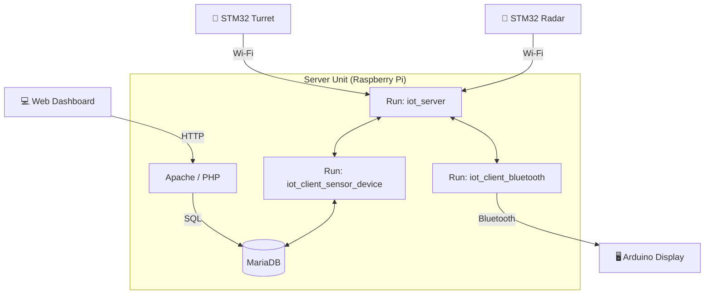

# 🛡️ IoT Smart Radar & Auto-Aiming Turret System

<div align="center">
  
  
  
  
</div>

<br>

**초음파 레이더로 지형을 스캔하여 침입자를 감지하고, 터렛이 자동으로 조준/사격하는 지능형 보안 시스템입니다.**

STM32(FreeRTOS) 기반의 정밀 제어 유닛들과 라즈베리파이 중앙 서버(Socket/DB/Web)가 유기적으로 연동되어, 실시간 탐지 정보를 웹 대시보드와 OLED 디스플레이로 시각화합니다.

---

## 📺 Demo Preview

| 터렛 조준&발사 | 레이더 화면(html) | 레이더 화면(Arduino) |
| :---: | :---: |
|  |  |  |

*터렛 조중 화면(좌), 레이더 화면(html)(중), 레이더 화면(OLED) (우)*

---

## 🏗️ System Architecture

전체 시스템은 **Raspberry Pi 중앙 서버**를 허브(Hub)로 하는 **Star Topology** 구조입니다. 데이터베이스 처리와 블루투스 통신은 별도의 클라이언트 프로세스로 모듈화되어 있습니다.



### 1. Central Server (Raspberry Pi)
* **IoT Socket Server (`iot_server`):** 다중 클라이언트(`pthread`) 접속을 처리하며, 메시지 라우팅(`From -> To`)을 담당합니다. `idpasswd.txt`를 통해 기기 인증을 수행합니다.
* **DB Handler (`iot_client_sensor_device`):** 소켓 서버에 'SQL'이라는 ID로 접속하여, 다른 기기들의 DB 요청(INSERT, SELECT, UPDATE)을 처리하는 **마이크로서비스**입니다.
* **Bluetooth Bridge (`iot_client_bluetooth`):** 소켓 서버와 블루투스(RFCOMM) 간의 양방향 통신을 중계합니다.
* **Web Dashboard:** Apache/PHP 기반으로 DB 데이터를 폴링하여 Canvas API로 레이더를 시각화합니다.

### 2. Edge Devices
* **Radar Unit (STM32):** 지형 학습 알고리즘을 수행하고, 이상 감지 시 좌표를 서버로 전송합니다.
* **Turret Unit (STM32):** 서버에서 받은 좌표로 서보모터를 제어하고 레이저를 발사합니다.
* **Display Unit (Arduino):** 블루투스로 수신한 좌표 데이터를 OLED 화면에 점으로 표시합니다.

---

## 🚀 Key Features & Logic

### 1. Intelligent Detection (Radar)
* **Landform Learning:** 초기 구동 시 `get_landform` 모드로 배경 지형(거리)을 학습하여 메모리에 저장합니다.
* **Anomaly Detection:** 실시간 측정값이 학습된 배경과 임계값(±10cm) 이상 차이가 나면 물체로 인식합니다.
* **Coordinate Conversion:** 극좌표계(거리, 각도) 데이터를 직교좌표계(X, Y)로 변환하여 전송합니다.

### 2. Auto-Aiming & Firing (Turret)
* **Data Parsing:** `[TURRET_1]X@Y` 패킷을 수신 및 파싱합니다.
* **Angle Calculation:** `atan2(y, x)` 역탄젠트 함수를 이용해 목표물의 각도를 계산합니다.
* **Action:** 서보모터 회전 -> GPIO High (레이저 ON, 3초) -> `[RADAR_1]OK` 응답 전송.

### 3. Data Visualization (Web & OLED)
* **Web Radar:** HTML5 Canvas를 이용해 레이더 스캔 라인과 잔상(Fading Blip) 효과를 구현했습니다.
* **OLED Radar:** 아두이노가 블루투스로 좌표를 수신하여 0.96인치 화면에 매핑합니다.

---

## 📡 Communication Protocol

모든 메시지는 **Socket Server**를 경유하며, 아래 형식을 따릅니다.

**기본 포맷:** `[TARGET_ID]MESSAGE`
**(서버가 수신자에게 전달할 때: `[SENDER_ID]MESSAGE`)**

| Source | Target | Message Example | Description |
|:---:|:---:|:---|:---|
| **Auth** | Server | `[ID:PASSWD]` | 최초 접속 시 인증 (`idpasswd.txt` 참조) |
| **Radar** | Turret | `[TURRET_1]15.5@20.2` | 좌표 전송 및 조준 요청 |
| **Radar** | SQL | `[SQL]SETDB@RADAR@15.5,20.2` | 감지 좌표 DB 저장 요청 |
| **Turret** | Radar | `[RADAR_1]OK` | 사격 완료 응답 |
| **Web** | SQL | `[SQL]GETDB@RADAR` | 최신 좌표 조회 (DB Handler가 처리) |
| **SQL** | Web/App | `[REQ_ID]GETDB@RADAR@15.5,20.2` | DB 조회 결과 응답 |

---

## 💾 Installation & Setup

### 1. Server Side (Raspberry Pi)
```bash
# 1. 필수 패키지 설치
sudo apt-get install libbluetooth-dev libmysqlclient-dev apache2 php php-mysql mariadb-server

# 2. 소스코드 컴파일
make all  # 또는 아래 명령어 직접 입력
gcc iot_server.c -o iot_server -pthread
gcc iot_client_sensor_device.c -o iot_client_sensor_device -lmysqlclient -pthread
gcc iot_client_bluetooth.c -o iot_client_bluetooth -lbluetooth -pthread

# 3. DB 및 Web 설정
# (MariaDB에 'iotdb' 데이터베이스 및 'sensor', 'device' 테이블 생성 필요)
sudo cp ./web/*.php /var/www/html/
sudo cp ./web/*.html /var/www/html/

# 4. 서버 실행 (순서 중요)
./iot_server 5000 &
./iot_client_sensor_device 127.0.0.1 5000 SQL &
./iot_client_bluetooth 127.0.0.1 5000 BRIDGE &
```

### 2. Embedded Firmware
* **STM32:** STM32CubeIDE에서 `Radar` 및 `Turret` 프로젝트 빌드 후 다운로드.
* **Arduino:** Arduino IDE를 이용해 `Display` 펌웨어 업로드.

---
